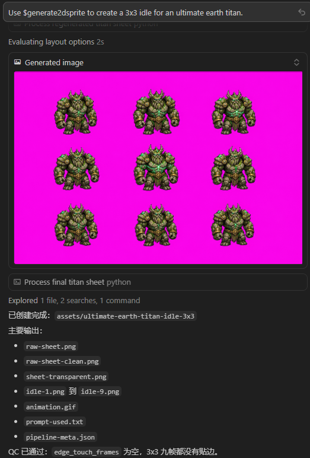
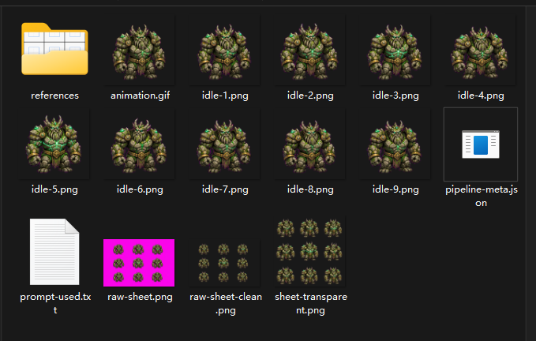
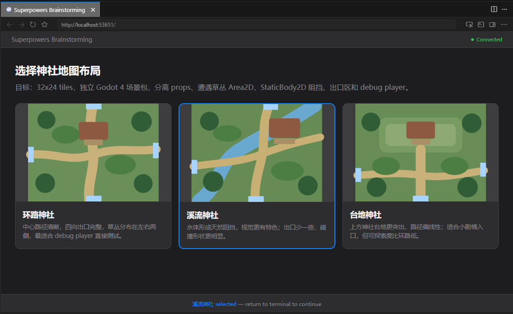
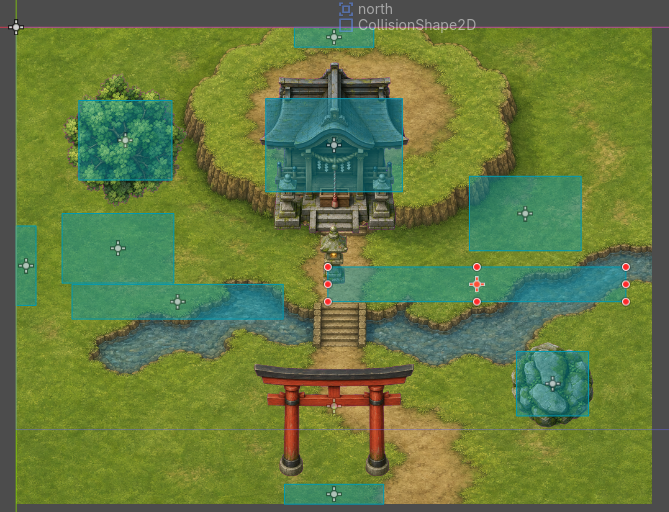
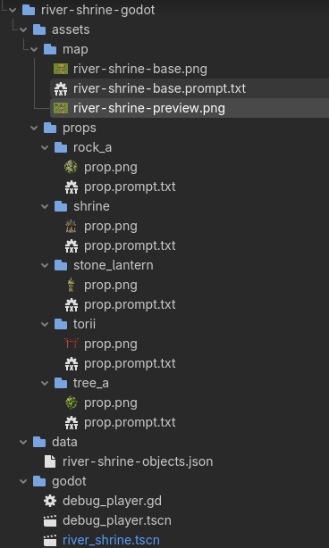

# agent-sprite-forge-for-cursor

在 **Cursor** 中测试 [agent-sprite-forge](https://github.com/0x0funky/agent-sprite-forge) 的工作环境。

原仓库面向 Codex CLI 设计，本仓库把 skills 接到 Cursor 的项目级技能目录 `.cursor/skills/`，并保留原仓库的 Python 后处理脚本与示例素材，整套「Agent 出图 + Python 后处理」流程在 Cursor 里可直接触发。

## 安装步骤

1. 克隆本项目：

```bash
git clone <this-repo-url>
cd generate-sprites
```

2. 下载 / 更新子模块（`agent-sprite-forge`）：

```bash
git submodule update --init --recursive
```

3. 安装 Python 依赖（建议使用虚拟环境隔离）：

```bash
python -m venv .venv
python -m pip install -r agent-sprite-forge/requirements.txt
```

激活虚拟环境：

```bash
# PowerShell
.\.venv\Scripts\Activate.ps1

# Git Bash
source .venv/Scripts/activate
```

4. 在 Cursor 中打开本项目目录。

## Cursor 中的使用方法

1. **重启 Cursor**（或新开一个 Agent 会话）以重新加载 `.cursor/skills/`。
2. 在 Agent 里用自然语言触发(注意需要选择能生成图片的模型比如GPT5.5而不是Auto)：
   - `Use $generate2dsprite to create a 3x3 idle for an ultimate earth titan.`
   - `Use $generate2dsprite to create a side-view lightning knight attack animation.`
   - `Use $generate2dmap to create a top-down RPG forest shrine map ...`

## 示例

### 角色精灵（生成示例）


输入提示词


生成如上图片

### 地图（生成示例）

生成过程会用superpower生成网页供你选择（得益于GPT-5.5的强力）


生成直接在godot中使用的场景（甚至包含了不精准的collider）


并非生成单图，而是地图中每个元素独立一张图片，保留了提示词，可以用于二次加工或者图片素材更新。

## 关键差异

- `image_gen`：原 SKILL.md 里写的是 Codex CLI 的内置工具名 **`image_gen`**。Cursor 没有同名工具；如果当前模型/会话具备图像生成能力，Agent 会用自身能力完成出图。**SKILL.md 保持不改**，把 `image_gen` 当作“调用图像生成工具”的语义即可。
- 不出图时：通常是当前会话未绑定图像生成能力；切换到支持图像生成的模型/配置后再试。

## 后处理脚本

两个 skill 各自带 Python 脚本（仓库里有两套路径，内容/用途一致）：

- `agent-sprite-forge/skills/.../scripts/`
- `.cursor/skills/.../scripts/`

Agent 触发后会自动调用这些脚本；需要手动调试时可用：

```bash
python agent-sprite-forge/skills/generate2dsprite/scripts/generate2dsprite.py --help
python agent-sprite-forge/skills/generate2dmap/scripts/extract_prop_pack.py --help
python agent-sprite-forge/skills/generate2dmap/scripts/compose_layered_preview.py --help
```

### 脚本功能说明

#### `generate2dsprite.py`

用于**生成提示词**与对“洋红底(#FF00FF)精灵图”做**本地后处理**（抠透明、切帧、合成 sheet、导出 GIF、输出 QC 元数据）。

- **主要命令**
  - `list-options`：打印支持的 target/mode、NPC 角色、网格形状、帧标签等。
  - `build-prompt`：根据 `--target/--mode/--prompt/--role/--seed` 生成图像生成提示词（可写入文本/JSON）。
  - `process`：对输入图片做后处理并导出资源。
- **常见输入**
  - `--input <png>`：模型生成出来的原图（通常是多格拼图或单体图）。
  - `--target`：`creature | player | npc | asset`
  - `--mode`：不同 target 下有不同模式（例如 creature 的 `idle/evolution/walk/...`，player 的 `player_sheet` 等）
  - 可选网格：`--rows/--cols`（自定义网格），或使用内置 mode 对应网格。
- **主要输出（到 `--output-dir`）**
  - 单帧 PNG：按模式帧标签导出（例如 `idle-1.png`、`walk-1.png` 等）
  - `sheet-transparent.png`：透明背景的拼图 sheet
  - `animation.gif`（或 `player_sheet` 模式下按方向导出 `down.gif/left.gif/...` 与条带图）
  - `pipeline-meta.json`：包含阈值、网格、帧 bbox/QC 信息、是否触边等

#### `extract_prop_pack.py`

用于把“洋红底道具包大图（prop-pack sheet）”按网格**拆成独立透明道具 PNG**，并生成 manifest 方便后续摆放与回放。

- **常见输入**
  - `--input <png>`：prop pack 大图（洋红底）
  - `--rows/--cols`：prop pack 的网格规格
  - 可选标签：`--labels`（逗号分隔）或 `--labels-file`（逐行），支持用 `empty/skip/-` 跳过格子
- **主要输出（到 `--output-dir`）**
  - 每个道具一个目录：`<label>/prop.png`
  - `prop-pack.json`（或 `--manifest` 指定路径）：记录 accepted/rejected、每格 bbox/QC、触边列表等

#### `compose_layered_preview.py`

用于把**底图**与**摆放 JSON(placements)** 叠加，生成一张“扁平化的分层预览图”（方便快速检查摆放效果）。

- **常见输入**
  - `--base <png>`：底图（RGBA）
  - `--placements <json>`：摆放描述（支持 `props/foreground/objects` 或直接 list）
  - 摆放项常用字段：`image/path, x, y, w/h(或 width/height), opacity, anchor, layer, sortY`
- **主要输出**
  - `--output <png>`：合成预览图
  - `--report <json>`（可选）：记录实际解析到的图片路径、最终粘贴坐标与尺寸等
